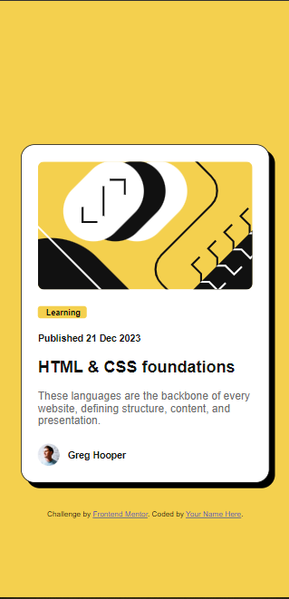
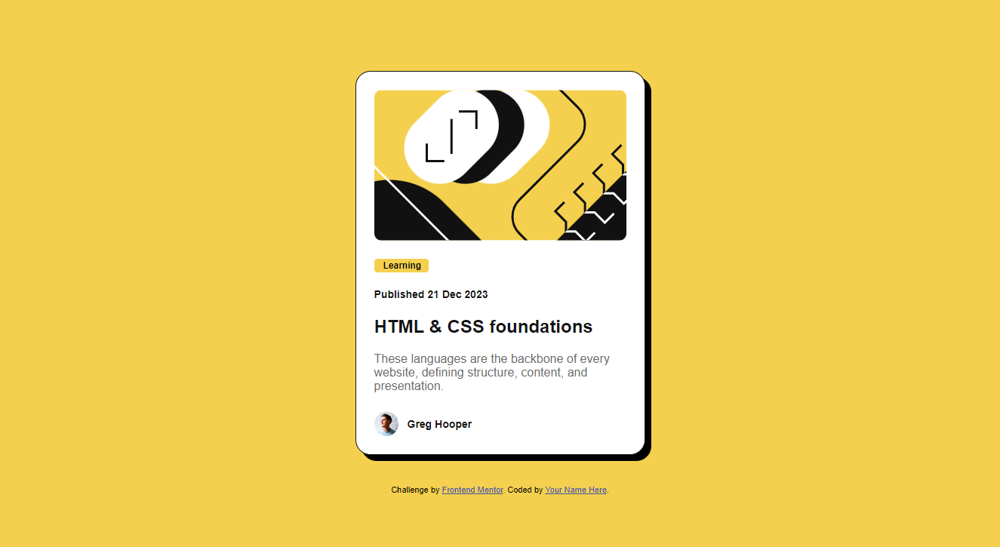

# Frontend Mentor - Blog preview card solution

This is a solution to the [Blog preview card challenge on Frontend Mentor](https://www.frontendmentor.io/challenges/blog-preview-card-ckPaj01IcS). Frontend Mentor challenges help you improve your coding skills by building realistic projects. 

## Table of contents

- [Overview](#overview)
  - [The challenge](#the-challenge)
  - [Screenshot](#screenshot)
  - [Links](#links)
- [My process](#my-process)
  - [Built with](#built-with)
- [Author](#author)

## Overview

### The challenge

Users should be able to:
- See hover and focus states for all interactive elements on the page
- Responsive design for the card

### Screenshot

Mobile View

Web View

### Links

- [Solution URL ](https://www.frontendmentor.io/solutions/blog-preview-card-wmJ03FwnS9)
- [Live Site](https://andreslamar.github.io/Blog-Preview-Card)

## My process

### Built with

- Semantic HTML5 markup
- CSS custom properties
- Flexbox
- CSS Grid
- Mobile-first workflow

## Author

- Portfolio - [Andrés Lamar](https://portfolio-delta-snowy-98.vercel.app/)
- Frontend Mentor - [@AndresLamar](https://www.frontendmentor.io/profile/AndresLamar)
