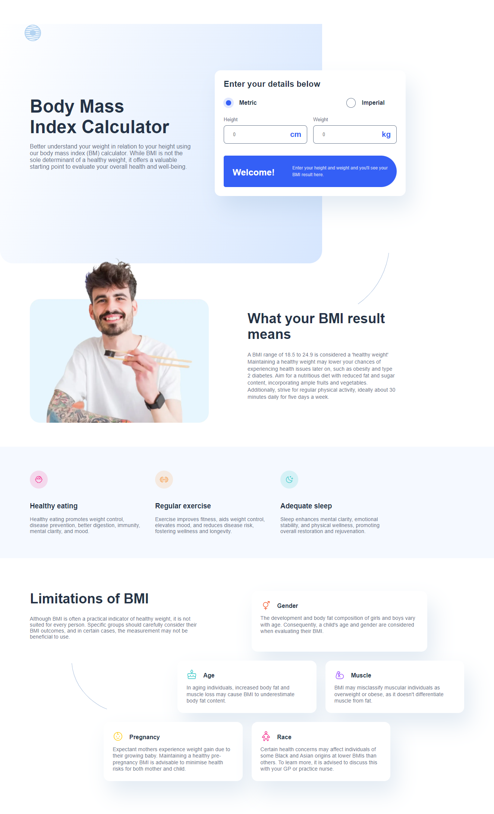
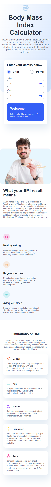

# Frontend Mentor - Body Mass Index Calculator solution

## Table of contents

- [Overview](#overview)
  - [The challenge](#the-challenge)
  - [Screenshot](#screenshot)
  - [Links](#links)
  - [Built with](#built-with)
- [Author](#author)

## Overview

### The challenge

Users should be able to:

- Select whether they want to use metric or imperial units
- Enter their height and weight
- See their BMI result, with their weight classification and healthy weight range
- View the optimal layout for the interface depending on their device's screen size
- See hover and focus states for all interactive elements on the page

### Screenshot

* Desktop

* Mobile 

### Links

- [Solution](https://github.com/AndresLamar/Frontend-Mentor/tree/main/Body%20Mass%20Index%20Calculator)
- [Live Site](https://body-mass-calculatorr.netlify.app/)

### Built with

- Semantic HTML5 markup
- CSS custom properties
- Flexbox
- CSS Grid
- Mobile-first workflow

## Author

- Portfolio - [Andrés Lamar](https://portfolio-delta-snowy-98.vercel.app/)
- Frontend Mentor - [@AndresLamar](https://www.frontendmentor.io/profile/AndresLamar)