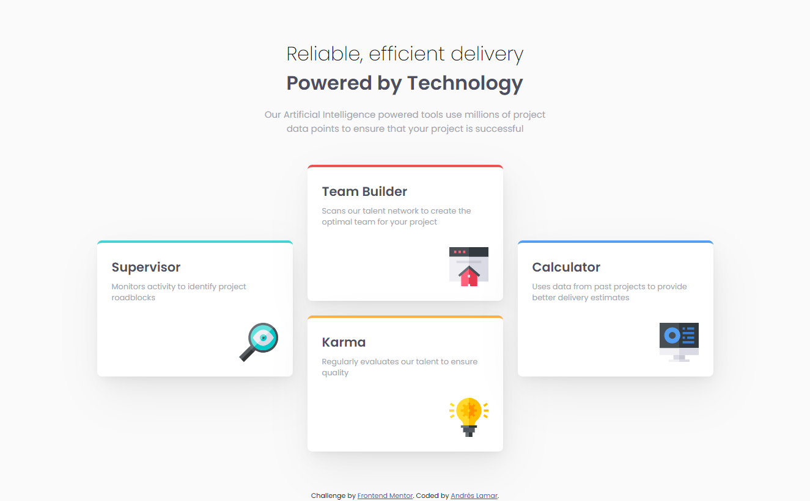
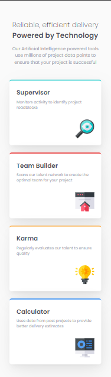

# Frontend Mentor - Four card feature section solution

This is a solution to the [Four card feature section challenge on Frontend Mentor](https://www.frontendmentor.io/challenges/four-card-feature-section-weK1eFYK). Frontend Mentor challenges help you improve your coding skills by building realistic projects. 

## Table of contents

- [Overview](#overview)
  - [The challenge](#the-challenge)
  - [Screenshots](#screenshots)
- [My process](#my-process)
  - [Built with](#built-with)
  - [What I learned](#what-i-learned)
- [Author](#author)

## Overview

### The challenge

Users should be able to:

- View the optimal layout for the site depending on their device's screen size

### Screenshots

- Desktop

- Mobile

### Links

- [Solution](https://frontendmentor.io/solutions/four-card-feature-section-3v8Kb_fQ6a)
- [Live site](https://andreslamar.github.io/Frontend-Mentor/Four-Card-Feature-Section/)

## My process

### Built with

- Semantic HTML5 markup
- CSS custom properties
- Flexbox
- CSS Grid
- Mobile-first workflow

### What I learned

I learned to use grid-template-areas.

## Author

- Portfolio - [Andrés Lamar](https://portfolio-delta-snowy-98.vercel.app/)
- Frontend Mentor - [@AndresLamar](https://www.frontendmentor.io/profile/AndresLamar)
