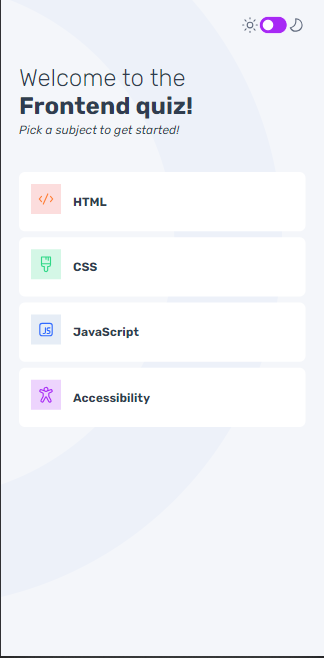

# Frontend Mentor - Frontend Quiz App

### Screenshots

- Desktop Home

- Desktop Quizz Section

- Desktop Results Section

- Dark Mode

- Mobile

### Links

- [Live site](https://frontend-quizzapp.netlify.app/)

## My process

### Built with

- React
- Typescript
- React Router Dom
- Context API
- Flexbox
- CSS Grid
- Mobile-first workflow

## Author

- Portfolio - [Andrés Lamar](https://portfolio-delta-snowy-98.vercel.app/)
- Frontend Mentor - [@AndresLamar](https://www.frontendmentor.io/profile/AndresLamar)
