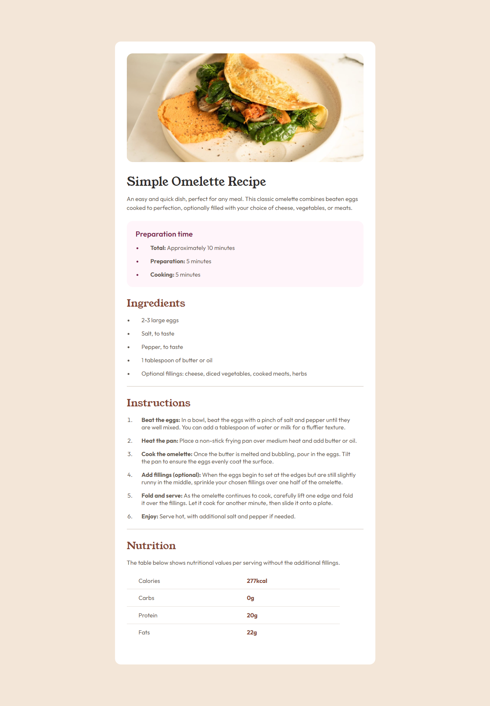
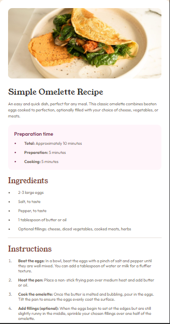

# Frontend Mentor - Recipe page solution

This is a solution to the [Recipe page challenge on Frontend Mentor](https://www.frontendmentor.io/challenges/recipe-page-KiTsR8QQKm). Frontend Mentor challenges help you improve your coding skills by building realistic projects. 

## Table of contents

- [Overview](#overview)
  - [Screenshot](#screenshot)
  - [Links](#links)
- [My process](#my-process)
  - [Built with](#built-with)
- [Author](#author)

## Overview

### Screenshot

### Links

- [Solution URL](https://www.frontendmentor.io/solutions/recipe-page-zxemyNf9iU)
- [Live Site URL](https://andreslamar.github.io/Frontend-Mentor/recipe-page/)

## My process

### Built with

- Semantic HTML5 markup
- Mobile-first workflow
- CSS custom properties
- Flexbox
- CSS Grid

## Author

- Portfolio - [Andrés Lamar](https://portfolio-delta-snowy-98.vercel.app/)
- Frontend Mentor - [@AndresLamar](https://www.frontendmentor.io/profile/AndresLamar)

